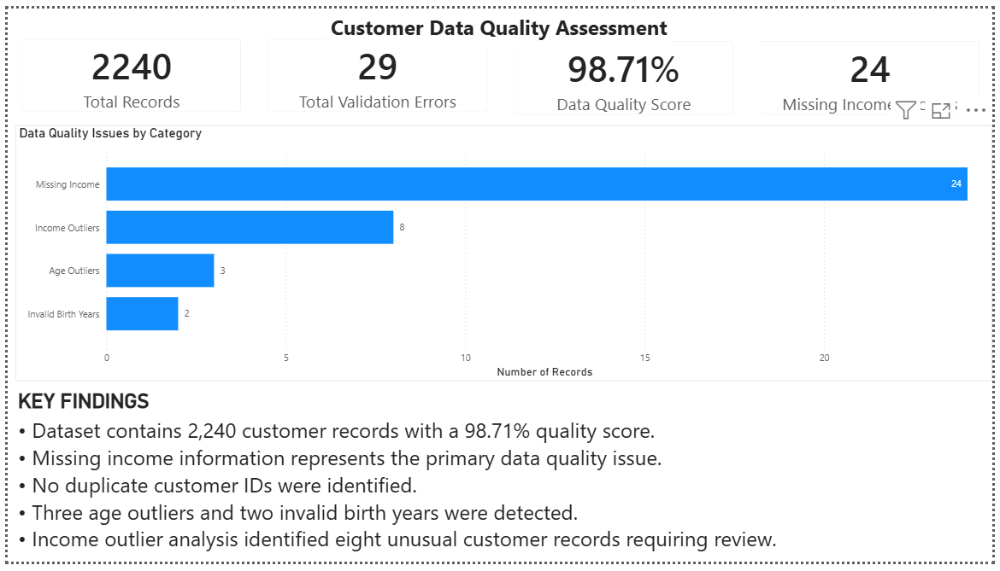
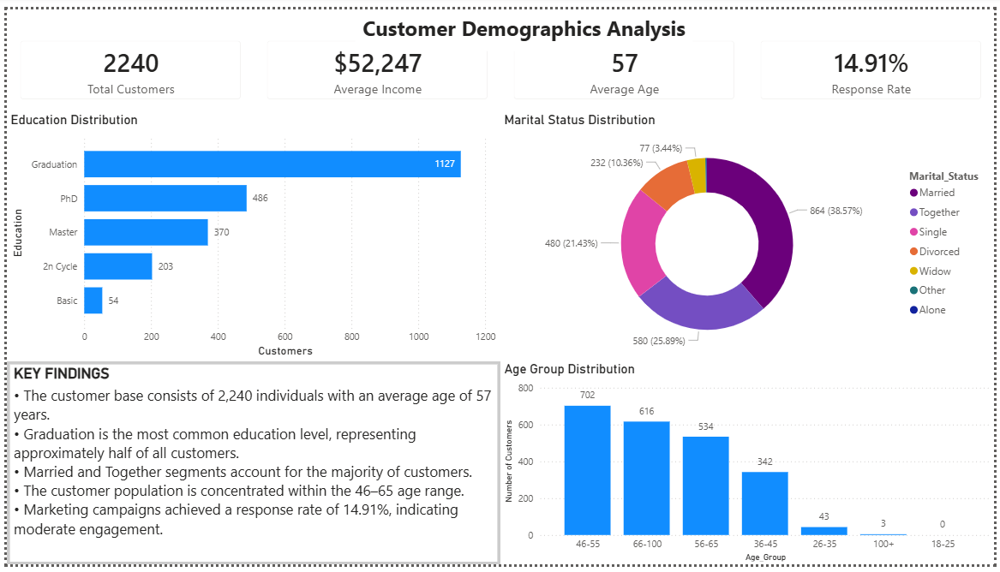
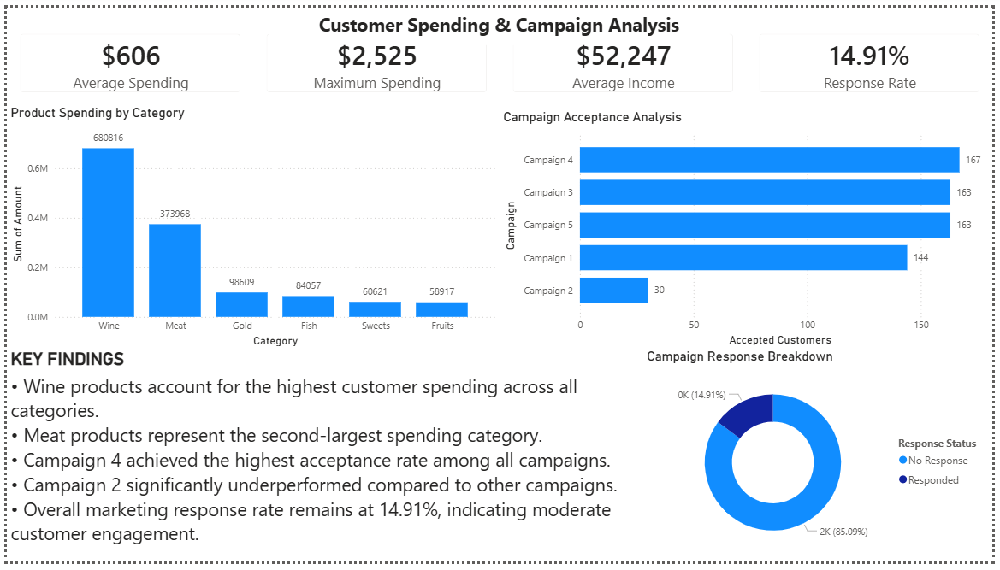

# Customer Data Quality Validation & Marketing Analytics Dashboard

## Project Overview

This project focuses on data quality assessment, customer analytics, and marketing campaign performance analysis using Python and Power BI.

The workflow includes:

* Data validation and quality assessment
* Missing value detection
* Duplicate record validation
* Outlier analysis
* Customer demographic analysis
* Spending behavior analysis
* Marketing campaign performance evaluation
* Interactive Power BI dashboard development

The project demonstrates an end-to-end analytics workflow from raw data validation to business intelligence reporting.

---

## Objectives

### Data Quality Assessment

* Identify missing values
* Detect duplicate customer records
* Validate customer birth years
* Detect age and income outliers
* Generate a Data Quality Score

### Customer Analytics

* Analyze customer demographics
* Evaluate income distribution
* Segment customers by age groups
* Study marital status and education profiles

### Marketing Analytics

* Measure campaign response rates
* Compare campaign performance
* Analyze customer spending behavior
* Identify top-performing product categories

---

## Dataset Information

The dataset contains:

* 2,240 customer records
* Demographic information
* Income data
* Product spending data
* Marketing campaign responses
* Customer purchase behavior

Key fields include:

* Income
* Education
* Marital Status
* Customer Birth Year
* Product Spending Categories
* Campaign Acceptance Indicators

---

## Project Structure

```text
Customer-Data-Quality-Validation-System/
│
├── data/
│   └── customer_data.csv
│
├── outputs/
│   ├── validation_summary.csv
│   ├── education_distribution.csv
│   ├── marital_status_distribution.csv
│   ├── age_group_distribution.csv
│   ├── income_distribution.csv
│   ├── customer_spending_summary.csv
│   ├── product_spending_analysis.csv
│   ├── campaign_response_analysis.csv
│   └── campaign_acceptance_analysis.csv
│
├── scripts/
│   ├── validation.py
│   └── analysis.py
│
├── powerbi/
│   └── Customer_Data_Quality_Dashboard.pbix
│
├── screenshots/
│   ├── page1_quality_assessment.png
│   ├── page2_demographics.png
│   └── page3_spending_campaigns.png
│
├── requirements.txt
└── README.md
```

---

## Validation Framework

The validation engine performs:

* Missing Income Detection
* Duplicate Customer ID Validation
* Birth Year Validation
* Future Date Validation
* Negative Spending Validation
* Negative Purchase Validation
* Binary Flag Validation
* Age Outlier Detection
* Income Outlier Detection (IQR Method)

### Validation Results

| Metric              | Result |
| ------------------- | ------ |
| Total Records       | 2,240  |
| Missing Income      | 24     |
| Duplicate IDs       | 0      |
| Invalid Birth Years | 2      |
| Age Outliers        | 3      |
| Income Outliers     | 8      |
| Data Quality Score  | 98.71% |

---

## Dashboard Pages

### Page 1 – Customer Data Quality Assessment

Features:

* Total Records KPI
* Validation Error KPI
* Data Quality Score KPI
* Missing Income KPI
* Data Quality Issue Breakdown

### Page 2 – Customer Demographics Analysis

Features:

* Average Income
* Average Age
* Response Rate
* Education Distribution
* Marital Status Distribution
* Age Group Analysis

### Page 3 – Customer Spending & Campaign Analysis

Features:

* Average Spending
* Maximum Spending
* Product Spending Analysis
* Campaign Acceptance Analysis
* Campaign Response Breakdown

---

## Dashboard Preview

### Page 1 - Customer Data Quality Assessment



### Page 2 - Customer Demographics Analysis



### Page 3 - Customer Spending & Campaign Analysis



---

## Key Business Insights

* Data quality score achieved 98.71%.
* Missing income values represent the primary data quality issue.
* Graduation is the dominant education category.
* Average customer income is approximately $52,247.
* Wine products generate the highest customer spending.
* Campaign 4 achieved the strongest customer acceptance.
* Campaign 2 significantly underperformed compared to other campaigns.
* Overall marketing response rate is 14.91%.

---

## Technologies Used

* Python
* Pandas
* NumPy
* Power BI
* CSV Data Processing

---

## Skills Demonstrated

* Data Validation
* Data Cleaning
* Exploratory Data Analysis (EDA)
* Business Intelligence
* Data Quality Assessment
* Customer Analytics
* Marketing Analytics
* Dashboard Development
* Data Visualization

---
